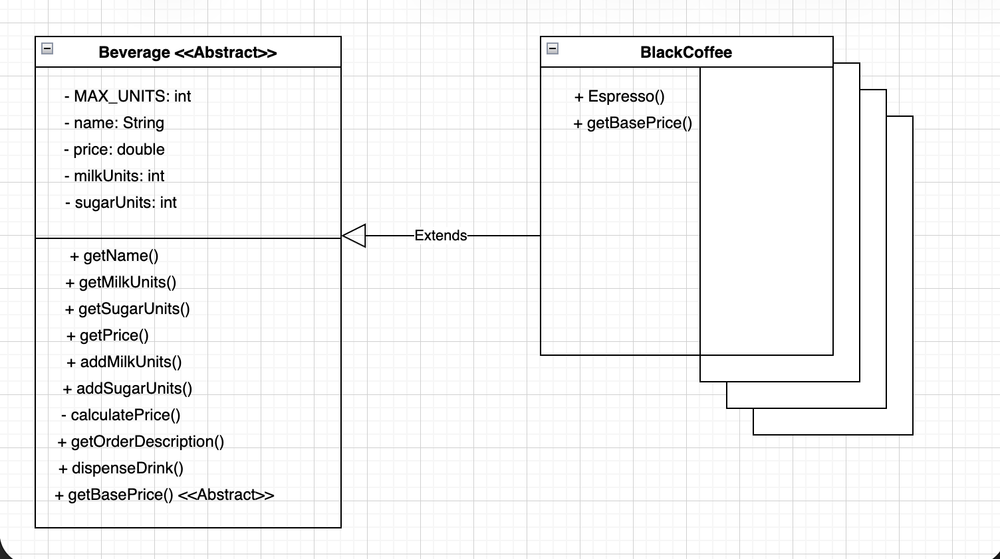

| CS-665       | Software Design & Patterns |
|--------------|----------------------------|
| Name         | Keith Kwan                 |
| Date         | 09/22/2025                 |
| Course       | Fall                       |
| Assignment # | 1                          |

# Assignment Overview

For assignment 1 we are tasked with creating an automated beverage machine that can dispense drinks
as well as add condiments to them. The beverage machine is required to dispense different type of
coffee and tea drinks. The condiments that a user is able to add is sugar and or milk, up to 3 units
of each. Each unit of condiment added was priced at 50 cents per unit.

# GitHub Repository Link:
https://github.com/kkeith88/cs-665-assignment-1

# Implementation Description 


For each assignment, please answer the following:

- Explain the level of flexibility in your implementation, including how new object types can
be easily added or removed in the future.
    - To include a new beverage into the automated machine, you would create the class in the beverage
    directory, set its name and base price, as well as override the abstract method to return the base
    price. Because this new drink would be extending the beverage class, most of the functions such
    as calculating the price and adding condiments will be inherited.
- Discuss the simplicity and understandability of your implementation, ensuring that it is
easy for others to read and maintain.
    - My approach to this assignment was to create an abstract beverage class and then have concrete
    classes inherit the functions and vars from the abstract beverage class. Since all the drinks
    share the same properties and function the same most of the attributes and methods are within
    the abstract class. In order to add a new drink, creating a new concrete class inheriting the 
    beverage class would allow it to function and act the same as the rest of the other drinks
- Describe how you have avoided duplicated code and why it is important.
    - To avoid code duplication I aimed to have most of the shared logic within the abstract beverage
    class. By doing so any of the concrete classes that inherit from beverages would have all
    the necessary functions to be placed inside a vending machine. 
- If applicable, mention any design patterns you have used and explain why they were
chosen.
    - No OO design patterns were explicitly used in this project

### Design Choices / Assumptions / Thought Process:

In this assigment, I decided that having an abstract beverage class and then using that as the blueprint
for the concrete classes would allow modular yet simpler design. When first reading the requirements
it stood out to me that all the different beverages function more or less the same. They each have a name,
price, sugar, and milk. Since all these beverages share the same fields I was able to keep them in the 
abstract class. However if we were to decide that this beverage machine would also serve drinks like
canned drinks or bottles we would have to slightly redefine what we consider a beverage. 

I had also considered the idea of making the add sugar and add milk functions into an interface, where
the concrete classes would have to implement. However I decieded this would cause uneccessary code
duplication 

# UML Diagram


Note: Other concrete classes are stacked below the espresso diagram. All other concrete classes have the same getBasePrice method and their respective constructor

# Maven Commands

We'll use Apache Maven to compile and run this project. You'll need to install Apache Maven (https://maven.apache.org/) on your system. 

## Compile
Type on the command line: 

```bash
mvn clean compile
```


## JUnit Tests
JUnit is a popular testing framework for Java. JUnit tests are automated tests that are written to verify that the behavior of a piece of code is as expected.

To run, use the following command:
```bash
mvn clean test
```


## Spotbugs 

SpotBugs is a static code analysis tool for Java that detects potential bugs in your code.
Use the following command:

```bash
mvn spotbugs:gui 
```

For more info see 
https://spotbugs.readthedocs.io/en/latest/maven.html

SpotBugs https://spotbugs.github.io/ is the spiritual successor of FindBugs.


## Checkstyle 

Checkstyle is a development tool for checking Java source code against a set of coding standards.
The following command will generate a report in HTML format that you can open in a web browser. 

```bash
mvn checkstyle:checkstyle
```

The HTML page will be found at the following location:
`target/site/checkstyle.html`


